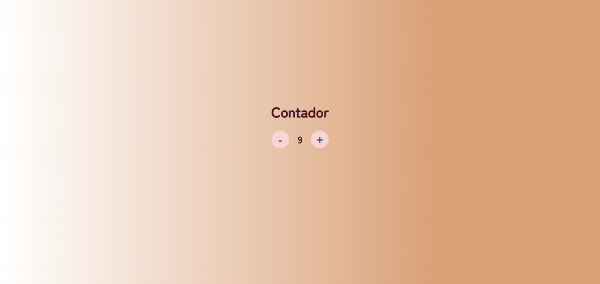
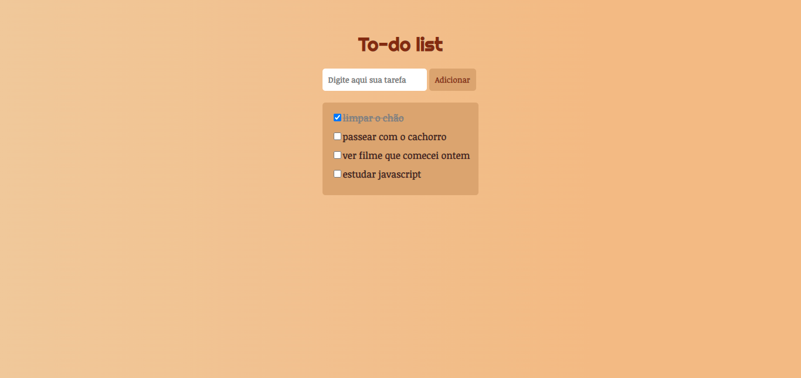

# Decola Tech 3° Edição 🚀
### Anotações e Exercícios do Bootcamp Decola Tech III, da DIO + Avanade

### Exercícios e Anotações:

#### 📔 [Sintaxe básica JS (anotações)](anotacoes-sintaxe-basica/readme.md) 
#### ⌨️ [Exercícios realizados durante as aulas](exercicios-de-aula)
#### 🖱️ [Desafios de código em JS](desafios-de-codigo) 
#
### Projetos:
####  ➖➕ [Contador](projetos/contador)
 
####  📑 [To-do List](projetos/to-do)
 
