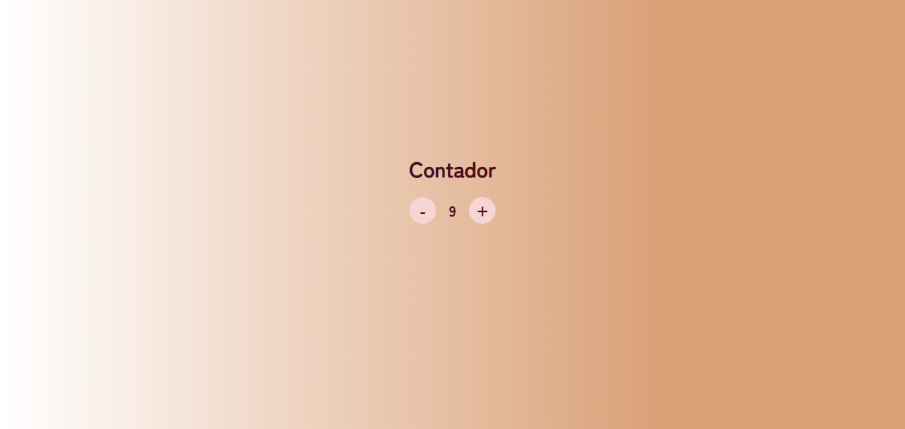
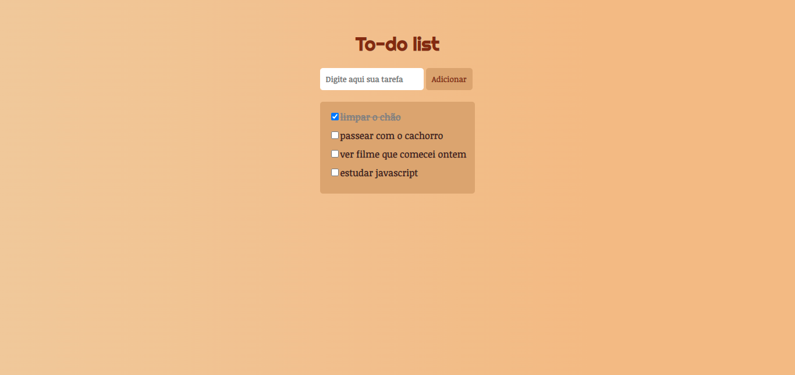

# Projetos para treino: JavaScript Básico 🚀
## Projeto 1: Contador ➖➕ 
Simples contador feito com JavaScript durante as aulas. 

Resultado final:

## Projeto 2: To-do List 📑
Simples contador feito com JavaScript durante as aulas. 

Resultado final:

